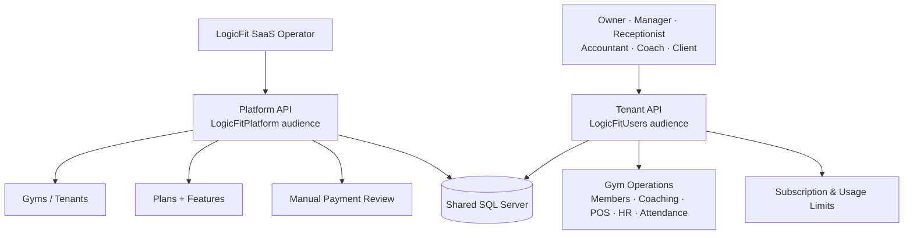
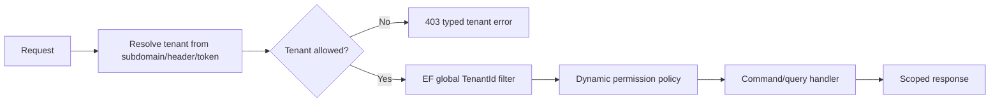
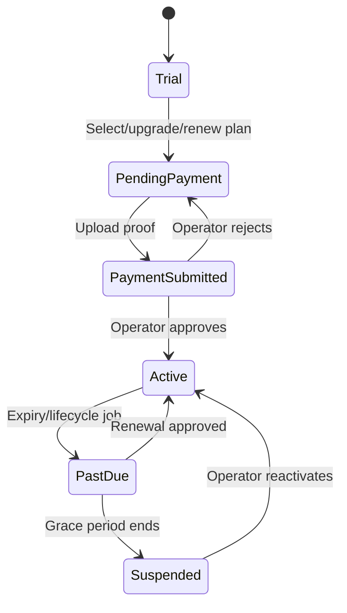

<div align="center">

# LogicFit

### Multi-Tenant SaaS Platform for Gym Management

[](https://dotnet.microsoft.com/)
[](https://docs.microsoft.com/en-us/dotnet/csharp/)
[](https://www.microsoft.com/sql-server)
[](https://docs.microsoft.com/en-us/ef/core/)
[](https://jwt.io/)
[](https://www.docker.com/)
[](https://xunit.net/)
[](LICENSE)

**Two-tier SaaS platform** — a central console for the operator and an isolated, white-labeled app for every gym.
Clean Architecture · CQRS · Dynamic RBAC · Manual-billing subscription engine.

[Highlights](#-whats-new) · [Features](#-features) · [Architecture](#-architecture) · [Quick Start](#-quick-start) · [Billing Model](#-saas-billing-model) · [Deployment](#-deployment)

---

</div>

## SaaS at a glance



The two APIs share the domain/application/infrastructure layers and database, but are separated by JWT audience and authorization policy. Tenant data is scoped by `TenantId`; a tenant user can never use the platform cross-tenant bypass.

### Who uses the product?

| User | Workspace | Main responsibilities |
|---|---|---|
| Platform Owner/Admin | Platform API | Onboard gyms, manage plans/features, review manual payments, activate/suspend tenants |
| Gym Owner | Tenant API | Configure the gym, manage staff, choose a plan, submit payment proof, view usage |
| Manager/Receptionist/Accountant | Tenant API | Daily operations according to database permissions |
| Coach | Tenant API | Assigned clients, workouts, measurements, progress |
| Client | Tenant API | Profile, subscriptions, appointments, workouts, meals, self-service |

### Tenant isolation model



### Manual billing lifecycle



## Overview

**LogicFit** is a comprehensive, multi-tenant **SaaS platform** for running fitness businesses. It ships as **two independently deployable APIs** that share one database:

| Layer | Audience | What it does |
|-------|----------|--------------|
| **Platform API** | Platform Owner / Admin (SaaS operator) | Onboards gyms, manages plans & features, reviews manual payments, activates/suspends tenants |
| **Tenant API** | Owner / Manager / Receptionist / Accountant / Coach / Client | The full gym app — members, coaching, nutrition, POS, HR, attendance, and self-service subscription management |

Both APIs are built on **Clean Architecture** with **CQRS + MediatR**, secured by **JWT** with a **dynamic, database-driven permission system**, and isolated per gym through **automatic tenant filtering**.

---

## What's New

> LogicFit evolved from a single gym-management app into a full **SaaS platform**. The highlights of that transformation:

- **Two-tier architecture** — a separate Platform API for the operator, isolated from the tenant app by **JWT audience**.
- **Dynamic RBAC** — permissions live in the database (`Roles / Permissions / RolePermissions / UserRoles`); policies are synthesized at runtime, so access can change **without redeploying**.
- **SaaS subscription engine** — plans, features, per-plan limits, and tenant subscriptions.
- **Manual billing** — gym owners upload a payment proof, the operator approves it, and the subscription activates in a single atomic transaction (designed to drop in a payment gateway later, no rebuild).
- **Feature gating & usage limits** — enforced centrally via a MediatR pipeline behavior with live counts.
- **White-label & custom domains** — per-gym branding served publicly for pre-login theming.
- **Automated lifecycle** — background jobs handle trial/expiry → past-due → suspension, reminders, and usage rollups.
- **Notifications** — in-app + pluggable email channel wired into billing events.
- **Production-ready** — health checks, Docker, GitHub Actions CI, and an xUnit test project.
- **Hardened security** — refresh-token rotation & revocation, secrets out of source control, tenant-isolation guards, and no privilege escalation on public registration.

---

## Features

<table>
<tr>
<td width="50%" valign="top">

### Platform (Operator)
- Gym (tenant) onboarding with owner provisioning
- Tenant lifecycle: approve · activate · suspend · archive
- SaaS **plans** & **features** management (CRUD)
- Configurable manual **payment methods**
- **Payment review** — approve / reject with reason
- Platform-wide subscriptions & reporting

### Membership & Coaching
- Client profiles, health data, progress photos
- Coach ↔ client assignment & progress tracking
- Workout programs, routines, sessions (RPE / volume)
- Diet plans, macros, food database, meal logging
- Body measurements & personal records

</td>
<td width="50%" valign="top">

### Operations & Commerce
- Multi-branch, rooms, equipment, maintenance
- Attendance & QR gate access, membership cards
- POS sales, products, inventory, suppliers
- Finance: invoices, payments, expenses, coupons, tax
- HR: employees, shifts, leaves, commissions, payroll

### Subscription & Billing (per gym)
- Browse plans · select · **upgrade** · **renew**
- Live **usage vs. plan limits**
- Upload payment proof, track request status
- Subscription invoices & payment history

### Engagement & Branding
- In-app chat, notifications, challenges
- Appointments & group classes
- **White-label** branding + custom domain

</td>
</tr>
</table>

---

## Architecture

Two API hosts over four shared layers:

```
                         ┌──────────────────────────────────────────┐
   Platform Admin  ────► │  LogicFit.Platform.API   (aud: Platform)  │ ─┐
                         └──────────────────────────────────────────┘  │
                                                                        │  same
   Gym users (Owner…    ┌──────────────────────────────────────────┐   ├─ Application
   Coach, Client)  ────► │  LogicFit.API            (aud: Users)     │ ─┤  Infrastructure
                         └──────────────────────────────────────────┘  │  Domain
                                                                        │  + one Database
                         ┌──────────────────────────────────────────┐  │
                         │   Application (CQRS · MediatR · Behaviors) │  │
                         │   Infrastructure (EF Core · JWT · Jobs)    │ ◄┘
                         │   Domain (Entities · Enums · Rules)        │
                         └──────────────────────────────────────────┘
```

- **Isolation between APIs** — a token minted for one host fails audience validation on the other (`LogicFitPlatform` vs `LogicFitUsers`).
- **Isolation between gyms** — EF Core global query filters scope every tenant entity by `TenantId`; platform users read cross-tenant via a null-tenant bypass, guarded so a tenant user can never do the same.

### Project Structure

```
LogicFit/
├── LogicFit.Domain/            # Entities, Enums, Value Objects, Authorization catalog, Exceptions
├── LogicFit.Application/        # CQRS (Commands/Queries/Handlers), Behaviors, Interfaces, Services
├── LogicFit.Infrastructure/     # EF Core DbContext, Configurations, Migrations, Identity/JWT,
│                                #   Seeders (RBAC/Plans), Background jobs, Email/Notifications
├── LogicFit.API/                # Tenant API  — gym app controllers, tenant middleware
├── LogicFit.Platform.API/       # Platform API — operator console controllers
└── LogicFit.Tests/              # xUnit tests
```

---

## Security & Multi-Tenancy

| Concern | Implementation |
|---------|----------------|
| **Authentication** | JWT Bearer; access tokens short-lived (15 min) with **refresh-token rotation, revocation & surface-binding** |
| **Authorization** | Dynamic, DB-driven permissions surfaced as `permission` claims; policies synthesized by a custom `IAuthorizationPolicyProvider` |
| **Tenant isolation** | Automatic `TenantId` query filters + middleware that resolves the tenant **before** authorization and rejects unresolved tenant users |
| **API isolation** | Distinct JWT **audience** per host |
| **Passwords** | BCrypt hashing |
| **Secrets** | Kept out of source — **user-secrets** (dev) / **environment variables** (prod); never in `appsettings.json` |
| **Registration** | Public register **always** creates a `Client` — no role escalation; staff/owners are created through guarded flows |
| **Auditing** | Automatic audit log (old/new values, IP, user-agent) on every change |

---

## Roles & Dynamic RBAC

Permissions are data, not code. System roles ship seeded, and gyms can define custom roles.

| Scope | Roles | Default access |
|-------|-------|----------------|
| **Platform** | `PlatformOwner`, `PlatformAdmin` | Manage tenants, plans, payment reviews, platform reports |
| **Tenant** | `Owner` | All gym permissions |
| | `Manager` | Everything except settings & billing |
| | `Receptionist` | Members, attendance, client subscriptions, POS |
| | `Accountant` | Finance, reports, tenant billing |
| | `Coach` | View members, attendance, own trainee reports |
| | `Client` | Self-service only |

Permission catalog (tenant): `ManageMembers`, `ViewMembers`, `ManageCoaches`, `ManageAttendance`, `ManageClientSubscriptions`, `ManagePOS`, `ManageInventory`, `ManageEmployees`, `ManageBranches`, `ManageFinance`, `ViewReports`, `ManageReports`, `ManageSettings`, `ManageTenantBilling` — plus platform permissions (`ManagePlatform`, `ManageTenants`, `ManagePlans`, `ManagePaymentRequests`, `ManagePlatformReports`).

---

## SaaS Billing Model

**Manual payment** — no gateway required, yet the schema is gateway-ready.

```
Owner:  browse plans → select plan (PendingPayment) → view payment methods
        → pay out-of-band → upload proof (PaymentRequest)
                                     │
Operator: review → Approve ─────────┼─ atomic: activate/extend subscription,
                                     │          set gym Active, create payment
                                     │          record + paid invoice, notify owner
                    Reject  ─────────┴─ record reason, keep PendingPayment, notify owner
```

- **Plans** carry price, billing cycle, and limits (`MaxMembers/Coaches/Branches/Employees`, `null = unlimited`) plus feature codes.
- **Feature gating & limits** are enforced before create operations via a MediatR behavior using **live counts**; gyms without an active plan are grandfathered. Violations return **HTTP 402**.
- **Lifecycle jobs** (daily) move subscriptions trial/active → past-due → suspended, send expiry reminders, expire stale payment requests, and refresh the usage cache.

---

## Tech Stack

| Category | Technologies |
|----------|-------------|
| **Framework** | .NET 8 · ASP.NET Core Web API |
| **Language** | C# 12 |
| **Data** | SQL Server · Entity Framework Core 8 |
| **Architecture** | Clean Architecture · CQRS · Mediator · Pipeline Behaviors |
| **Libraries** | MediatR · FluentValidation · Serilog · BCrypt.Net |
| **Security** | JWT Bearer · dynamic policy-based authorization · refresh-token rotation |
| **Ops** | Health Checks · Docker · GitHub Actions CI · xUnit |
| **Docs** | Swagger / OpenAPI (Development) |

---

## Quick Start

### Prerequisites
- [.NET 8 SDK](https://dotnet.microsoft.com/download/dotnet/8.0)
- [SQL Server](https://www.microsoft.com/sql-server) (LocalDB / Express / remote)

### 1) Clone & restore
```bash
git clone https://github.com/AhmedSalem104/LogicFit.git
cd LogicFit
dotnet restore
```

### 2) Configure secrets (never commit these)
```bash
# Tenant API
dotnet user-secrets set "ConnectionStrings:DefaultConnection" "<your-connection-string>" --project LogicFit.API
dotnet user-secrets set "JwtSettings:Secret" "<64+ char random secret>"                  --project LogicFit.API

# Platform API (same DB; independent secret is fine)
dotnet user-secrets set "ConnectionStrings:DefaultConnection" "<your-connection-string>" --project LogicFit.Platform.API
dotnet user-secrets set "JwtSettings:Secret" "<64+ char random secret>"                  --project LogicFit.Platform.API
```
> `appsettings.json` ships with **empty** `ConnectionStrings`/`Secret` by design. The tenant API uses audience `LogicFitUsers`; the platform API uses `LogicFitPlatform`.

### 3) Apply migrations
```bash
# Development env is required so user-secrets are loaded at design time
ASPNETCORE_ENVIRONMENT=Development dotnet ef database update \
  --project LogicFit.Infrastructure --startup-project LogicFit.API
```

### 4) Run
```bash
dotnet run --project LogicFit.API            # Tenant API (seeds RBAC, plans, platform owner on first run)
dotnet run --project LogicFit.Platform.API   # Platform API
```

**Default platform login** (change immediately): `owner@platform.local` / `ChangeMe#12345`
**Health check**: `GET /health` on either API.

---

## API Documentation

Swagger UI is available in **Development** on each API. Detailed integration guides:

| Document | Description |
|----------|-------------|
| [AGENTS.md](AGENTS.md) | Persistent execution rules, decisions, branch/PR policy, and deployment guardrails |
| [docs/LOGICFIT-PROJECT-STATUS.md](docs/LOGICFIT-PROJECT-STATUS.md) | Current architecture, product map, data boundaries, security, CI/CD, and deployment status |
| [AUTH_AND_REGISTRATION.md](AUTH_AND_REGISTRATION.md) | Authentication and registration contracts |
| [PLATFORM_FRONTEND_GUIDE.md](PLATFORM_FRONTEND_GUIDE.md) | Platform console integration notes |
| [FRONTEND_TENANT_ACCESS_GUIDE.md](FRONTEND_TENANT_ACCESS_GUIDE.md) | Tenant access and frontend integration notes |

### Selected endpoints

<details>
<summary><strong>Authentication (Tenant API)</strong></summary>

| Method | Endpoint | Description |
|:------:|----------|-------------|
| `POST` | `/api/auth/login` | Login by phone + password + gym `subdomain` → tokens + `roles[]` + `permissions[]` |
| `POST` | `/api/auth/register` | Public registration — **Client only** |
| `POST` | `/api/auth/refresh` | Rotate tokens |
| `POST` | `/api/auth/logout-all` | Revoke all refresh tokens |
| `GET`  | `/api/branding/{subdomain}` | Public white-label branding (pre-login theming) |
</details>

<details>
<summary><strong>Subscription & Billing (Tenant API · <code>ManageTenantBilling</code>)</strong></summary>

| Method | Endpoint | Description |
|:------:|----------|-------------|
| `GET`  | `/api/tenant/plans` | Available plans |
| `GET`  | `/api/tenant/my-subscription` | Current plan, status, limits, live usage |
| `GET`  | `/api/tenant/usage` | Usage vs. limits |
| `GET`  | `/api/tenant/invoices` | Subscription invoices |
| `GET`  | `/api/tenant/payment-methods` | Manual payment channels |
| `POST` | `/api/tenant/subscription/select-plan` · `/upgrade` · `/renew` | Open a payable subscription |
| `POST` | `/api/tenant/payment-requests` | Upload payment proof (multipart) |
</details>

<details>
<summary><strong>Platform (Platform API)</strong></summary>

| Method | Endpoint | Description |
|:------:|----------|-------------|
| `POST` | `/api/platform/auth/login` | Platform login |
| `GET`/`POST` | `/api/platform/tenants` `…/{id}/approve\|suspend\|activate\|archive` | Tenant lifecycle |
| `GET`/`POST`/`PUT`/`DELETE` | `/api/platform/plans` · `/features` · `/payment-methods` | SaaS catalog |
| `GET` · `POST …/{id}/approve\|reject` | `/api/platform/payment-requests` | Review manual payments |
</details>

---

## Deployment

- **Docker** — `Dockerfile` per API + `docker-compose.yml` (SQL Server + both APIs). Config via environment variables; background jobs run in the tenant host only (`BackgroundJobs__Enabled=false` on the platform host).
  ```bash
  docker compose up --build
  ```
- **CI** — GitHub Actions (`.github/workflows/ci.yml`) restores, builds, tests, validates EF migrations, and builds both images on every push/PR.
- **Release** — `master` and `develop` are protected. Production deployment is currently performed manually from Visual Studio/WebDeploy; the guarded GitHub CD path is retained for a future complete hosting configuration.
- **Health** — `GET /health` (includes a DB connectivity probe) for readiness checks.
- **Production config** — set `ConnectionStrings__DefaultConnection` and `JwtSettings__Secret` as environment variables; user-secrets are for local development only.

---

## Testing

```bash
dotnet test
```
`LogicFit.Tests` (xUnit) covers the permission catalog, notification templates, and the enum-value invariants that keep tenant status upgrades migration-safe.

---

## Contributing

1. Create a GitHub Issue with scope and acceptance criteria.
2. Start from the latest `develop` and create `feature/<issue>-<slug>`, `fix/<issue>-<slug>`, or `chore/<issue>-<slug>`.
3. Run restore/build/test and update documentation for behavior, API, data, security, or deployment changes.
4. Push the task branch and open a Pull Request into `develop`; never push directly to `develop` or `master`.

---

## License

Licensed under the MIT License — see [LICENSE](LICENSE).

---

<div align="center">

**Ahmed Salem** · [GitHub](https://github.com/AhmedSalem104)

[](https://github.com/AhmedSalem104)

<sub>Built with passion for the fitness community</sub>

</div>
