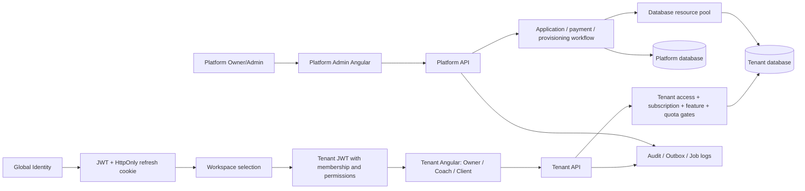

# LogicFit — التوثيق الكامل للمشروع

هذا هو دليل التسليم الموحد للمشروع كاملًا. يربط بين الـBackend وواجهة الصالة
وواجهة إدارة المنصة، ويشرح رحلة المستخدم، حالات الـDomain، حدود قواعد البيانات،
عقود الـAPI، الصلاحيات، النسخ الاحتياطية، النشر، ومعايير الاختبار.

> مصدر الحقيقة التنفيذي هو الكود والـControllers والـDTOs والـMigrations. حالة هذا
> الملف تصف الكود الموجود في المستودع المحلي/الفرع الحالي، ولا تعني وحدها أن السلوك
> نُشر في Production.

## 1. خريطة المستودعات

| المستودع | المسؤولية | نقطة التشغيل | التوثيق الخاص |
|---|---|---|---|
| `LogicFit` | .NET API، الـDomain، الـApplication، EF Core، Platform API، الـMigrations والاختبارات | `LogicFit.API` | هذا الملف، [كتالوج API](API-ENDPOINT-CATALOG.md)، [دليل التدفقات](AUTHENTICATION-AND-WORKSPACE-FLOWS.md) |
| `LogicFit_Angular` | تطبيق الصالة/المدرب الحر للـOwner وCoach وClient | Angular SPA | [دليل الشاشات الكامل](../../LogicFit_Angular/docs/COMPLETE-SCREEN-DOCUMENTATION.md) |
| `LogiFit_Platform_Admin_Dashboard` | لوحة إدارة SaaS المركزية | Angular SPA | [دليل إدارة المنصة الكامل](../../LogiFit_Platform_Admin_Dashboard/docs/COMPLETE-PLATFORM-ADMIN-DOCUMENTATION.md) |

## 2. الصورة المعمارية



القواعد الأساسية:

1. الـIdentity العامة ليست عضوية داخل مساحة عمل. العضوية هي التي تحدد الدور
   والصلاحيات والمساحة.
2. لا يختار المتصفح `TenantId` كحد أمني؛ الخادم يقرأه من الـJWT والعضوية وسياق
   المساحة.
3. Platform API منفصل منطقيًا عن Tenant API في المسار والصلاحيات، لكنه يعمل داخل
   نفس الـBackend الموحد.
4. Connection Strings وقيم الأسرار لا تُعاد إلى أي واجهة؛ الخادم يفك تشفيرها
   داخليًا فقط عند الحاجة.

## 3. التدفقات الأساسية من البداية للنهاية

### 3.1 إنشاء Gym أو FreelanceCoach

```text
اختيار النوع والباقة
  → إدخال بيانات المالك والمساحة والحقول الخاصة بالنوع
  → إنشاء Application
  → تسجيل/ربط Identity
  → تسجيل الدفع أو إنشاء Payment Request
  → UnderReview / طلب معلومات إضافية
  → اعتماد الدفع
  → اعتماد الطلب
  → حجز Database Resource من الـPool
  → Provisioning + Migrations + CanConnect + Health Check
  → إنشاء/إصلاح Owner Membership
  → إنشاء Subscription
  → Active + Ready + السماح بالدخول
```

الفرق بين النوعين هو خصائص المساحة فقط:

| النوع | الملكية | قاعدة البيانات | الوظائف الأساسية |
|---|---|---|---|
| `Gym` | Owner للجيم | مستقلة أو مورد مخصص من Pool | العملاء، الفروع، المدربون، العضويات، الحضور، المال والمخزون |
| `FreelanceCoach` | Owner لمساحة مستقلة | مستقلة مثل الجيم | العملاء، الاشتراكات، الجلسات، التدريب والتغذية والمدفوعات |

لا تصبح المساحة `Active` لمجرد قبول الطلب. شرط الدخول النهائي هو اكتمال بوابات
الطلب والدفع والمساحة والاشتراك والقاعدة والعضوية:

```json
{
  "applicationStatus": "Approved",
  "paymentStatus": "Approved",
  "workspaceStatus": "Active",
  "subscriptionStatus": "Active",
  "databaseStatus": "Ready",
  "membershipStatus": "Active",
  "canAccessDashboard": true
}
```

### 3.2 تسجيل الدخول واختيار المساحة

1. المستخدم يسجل بالبريد وكلمة المرور.
2. الخادم يتحقق من البريد المؤكد، كلمة المرور، حالة الهوية، والجلسات القديمة.
3. يعيد سياق الهوية والطلبات المعلقة والمساحات المرتبطة.
4. مساحة واحدة نشطة بلا طلب معلق يمكن أن تنتقل مباشرة إلى `select-workspace`.
5. أكثر من مساحة أو حالة تفعيل غير مكتملة تعرض شاشة اختيار/حالة تفعيل.
6. قبل إصدار Tenant JWT يتحقق الخادم من العضوية النشطة، حالة المساحة، الاشتراك،
   جاهزية قاعدة البيانات، والصلاحيات.
7. عند أي فشل يظهر `Loading` أو `Blocked` أو `Error` واضح؛ لا تُستدعى APIs خاصة
   بالـTenant أثناء `Provisioning` أو `DatabaseUnavailable`.

### 3.3 إنشاء موظف داخل الجيم

```text
Owner login → اختيار Gym → إدارة الفريق → بيانات الموظف → الدور والصلاحيات
→ إنشاء/ربط Identity → Membership داخل نفس Gym → كلمة مرور مؤقتة لمرة واحدة
→ PasswordChangeRequired → أول دخول → تغيير كلمة المرور → Active
```

القواعد: لا هوية مكررة، نفس الهوية يمكن أن تنتمي لأكثر من Gym، لا عضوية مكررة
داخل المساحة، كلمة المرور لا تُخزن نصًا صريحًا، إزالة العضوية لا تحذف الهوية،
وجميع العمليات الحساسة تُسجل في Audit Log.

### 3.4 إنشاء برنامج تدريب أو خطة تغذية

1. المدرب يفتح تفاصيل عميل مرتبط به داخل نفس Tenant.
2. ينشئ رأس البرنامج ثم عناصره المتداخلة: routines/exercises أو meals/foods.
3. الواجهة تحفظ الـAggregate من خلال API الخادم وتعرض loading وvalidation وfailure.
4. العميل يقرأ الخطة من بوابته فقط؛ لا يستطيع تعديل تعريف المدرب.
5. تسجيل الجلسة أو الوجبة ينشئ سجلًا جديدًا مرتبطًا بالعميل والخطة والـTenant.
6. عند ضعف الشبكة لا تُعلن الواجهة النجاح ولا تعيد Mutation مالية/جلسة بلا فحص
   نتيجة الخادم.

### 3.5 الدفع والاشتراك

الدفع اليدوي يمر بـ`Pending → Approved/Rejected`. اعتماد الدفع لا يساوي دائمًا
جاهزية قاعدة البيانات؛ اعتماد الطلب يبدأ/يتابع provisioning، ثم يُفعل الاشتراك
بعد تحقق الربط والـHealth Check. الاشتراكات لها حالات مستقلة عن حالة الطلب:
`PendingPayment`, `Trial`, `Active`, `PastDue`, `Suspended`, `Expired`, `Cancelled`,
`GracePeriod`.

### 3.6 Database Resource والنسخ الاحتياطية

```text
Unassigned → Reserved → Provisioning → Assigned/Ready
                         ↘ Failed/Unavailable
```

- Pool يمنع حجز نفس المورد لأكثر من Tenant.
- التسجيل يرسل Connection String عبر TLS إلى الخادم فقط.
- الخادم يشفر القيمة، ولا يعيدها؛ الواجهة ترى `hasProtectedConnection` فقط.
- الـProvisioning يشغل Migrations ثم `CanConnect` وHealth Check ثم Database Mapping.
- النسخة الاحتياطية تختار Scope من الخادم، وتنتج Batch وArtifacts وSHA-256 وManifest.
- الملفات والسجلات immutable، وإعادة المحاولة محصورة بالأهداف الفاشلة أو الجزئية.
- أي Restore يخضع لقدرات الخادم وسياسة `ManualOnly` ولا يظهر كزر إذا لم يكن متاحًا.

## 4. خريطة الحالات

### الطلب

| الحالة | المعنى | الدخول إلى Dashboard |
|---|---|---|
| `Draft` | بيانات غير مكتملة | لا |
| `PendingPayment` | بانتظار الدفع | لا |
| `Paid` | الدفع مستلم | لا، يلزم مراجعة |
| `UnderReview` | مراجعة الإدارة | لا |
| `MoreInfoRequired` | مطلوب حقول محددة | لا؛ يسمح بإرسال الحقول فقط |
| `Approved` | الطلب مقبول ويبدأ التجهيز | ليس حتى الجاهزية |
| `Rejected` | القرار مرفوض | لا |
| `Cancelled` | أُلغي الطلب | لا |

### مساحة العمل والاشتراك والقاعدة

| المفهوم | الحالات | شرط السماح بالدخول |
|---|---|---|
| Workspace | `Pending`, `Provisioning`, `Ready`, `ProvisioningFailed`, `Suspended`, `Archived` | `Ready` أو `Active` حسب السياسة |
| Subscription | `Pending`, `Trial`, `Active`, `PastDue`, `Suspended`, `Expired`, `Cancelled` | `Active` أو `Trial` المسموح |
| Database | `Unassigned`, `Assigned`, `Provisioning`, `Ready`, `Unavailable`, `Failed`, `Released` | `Ready` |
| Membership | `PendingSetup`, `PasswordChangeRequired`, `Active`, `Suspended`, `Locked`, `Removed` | `Active`، أو شاشة تغيير كلمة المرور للحالة المؤقتة |

### أخطاء الوصول

| HTTP | المعنى | تصرف الواجهة |
|---|---|---|
| `400` | validation أو قاعدة أعمال | إبراز الحقل/الرسالة دون إعادة التسجيل من البداية |
| `401` | جلسة مفقودة/منتهية | محاولة refresh مرة واحدة ثم تسجيل الدخول |
| `403` | دور أو صلاحية أو Tenant غير مسموح | شاشة منع واضحة، لا صفحة فارغة |
| `404` | مورد غير موجود أو خارج العزل | Empty/Not found دون كشف وجود بيانات أخرى |
| `409` | تعارض حالة أو RowVersion أو تكرار | إعادة القراءة ثم عرض أحدث حالة |
| `429` | حد المعدل | انتظار/رسالة واضحة وعدم التكرار السريع |
| `5xx` | فشل خادم | Error + Retry بعد فحص السجل والحالة |

## 5. عقد الـAPI والاستجابات

المرجع التفصيلي لكل Endpoint موجود في [API-ENDPOINT-CATALOG.md](API-ENDPOINT-CATALOG.md).
الكتالوج مولد من كل Controller ويحتوي لكل سجل على:

- `Method` و`Route` واسم الـAction.
- سياسة الوصول أو Anonymous.
- Body/Query/Route inputs وحقول DTO التي يمكن اكتشافها من المصدر.
- الاستجابة المعلنة وحقول DTO غير المخفية بـ`JsonIgnore`.
- نوع العملية، أهمية الـEndpoint، فائدته، الآثار الجانبية، وعقد الفشل.

### أشكال الاستجابة المشتركة

```json
{
  "items": [],
  "totalCount": 0,
  "page": 1,
  "pageSize": 20,
  "totalPages": 0,
  "hasPreviousPage": false,
  "hasNextPage": false
}
```

الـAuth response يعيد Access Token والهوية والصلاحيات ووقت الانتهاء فقط في JSON؛
قيمة Refresh Token transport-only و`[JsonIgnore]` وتنتقل إلى HttpOnly cookie.

استجابة الخطأ تتعامل معها الواجهات كـProblemDetails/ValidationProblemDetails:

```json
{
  "status": 409,
  "title": "Business rule or concurrency conflict",
  "detail": "Readable operator message",
  "errors": { "field": ["validation message"] },
  "traceId": "server trace id"
}
```

لا تُوضع كلمات مرور أو Tokens أو Connection Strings أو Payment Proofs داخل الأمثلة
أو السجلات أو Screenshots.

## 6. لماذا توجد وحدات الـAPI؟

| الوحدة | الفائدة |
|---|---|
| Identity/Auth | تثبيت هوية المستخدم وتدوير الجلسة وإجبار تغيير كلمة المرور بأمان. |
| Workspace Applications | تحويل التسجيل والدفع والمراجعة والتجهيز إلى Saga قابلة للتتبع. |
| Tenants/Members | تطبيق العزل وربط الأدوار والعضويات ومنع الوصول العرضي. |
| Plans/Features/Quotas | تحويل باقة SaaS إلى قواعد تشغيل قابلة للفحص بدل شروط متناثرة في الواجهة. |
| Payments/Subscriptions/Invoices | حفظ الأثر المالي ومنع تفعيل غير مستحق أو تعديل تاريخي. |
| Database Resources/Provisioning | فصل بيانات كل Tenant والتحقق من الاتصال والمigrations قبل الدخول. |
| Backups/Restores | حماية الاستمرارية وإثبات البصمة وتحديد نتيجة كل هدف. |
| Training/Nutrition/Client | تشغيل المنتج الأساسي للمدرب والمتدرب مع علاقة وعزل صحيحين. |
| Reports/Operations/Audit | إعطاء المشغل رؤية قابلة للتدقيق دون تعديل السجلات التاريخية. |

## 7. الصلاحيات والعزل

- Platform permissions مثل `ManageTenants`, `ManagePlans`, `ManagePaymentRequests`,
  `ManagePlatformBackups`, و`ManagePlatformReports` تخص منصة SaaS ولا تمنح Tenant access.
- Tenant permissions مثل `ManageMembers`, `ManageCoaches`, `ManageFinance`,
  `ManageEmployees`, `ViewReports` تطبق داخل مساحة العمل الحالية.
- `Owner` ليس اختصارًا لتجاوز كل بوابات الاشتراك؛ الخادم يطبق subscription, feature,
  quota, database, وmembership gates.
- Coach يرى العملاء المرتبطين به فقط. Client يرى بيانات هويته وخططه وسجلاته فقط.

## 8. النشر والتحقق

1. الفحص من المصدر المحلي الصحيح، وبالنسبة للـBackend المسار canonical هو:
   `C:\Users\B-SMART\Desktop\Projects\LogicFit Project\LogicFit`.
2. تشغيل مولد API ومراجعة الفرق.
3. Restore/Build/Test حسب المستودع.
4. مراجعة migrations ونسخة احتياطية وخطة rollback قبل Production.
5. النشر، ثم Health Check متكرر ينتظر `HTTP 200` و`Healthy`.
6. اختبار smoke للمصادقة، اختيار Workspace، شاشة الإدارة، وAPI المتأثر.
7. لا يثبت نجاح WebDeploy أو Vercel وحده نجاح التشغيل.

بعد كل تعديل، بما في ذلك تعديل التوثيق أو workflow، يجب تسجيل فحص `/health` في Issue
المرتبطة. فشل `500/503/Unhealthy` يوقف الاستمرار والتفعيل.

## 9. الاختبارات ومعايير القبول

- كل Route يملك Guard مناسبًا وحالة Loading/Empty/Error/Blocked.
- كل زر Mutation يعرض تأكيدًا عند الحساسية، loading، نجاحًا/فشلًا، ويمنع النقر المكرر.
- كل API ظاهر في الواجهة موجود في الكتالوج المولد ومربوط بالصلاحية الصحيحة.
- الطلبات المكررة لا تنشئ Tenant/Subscription/Membership/Mapping مكررًا.
- لا يسمح بالدخول قبل `Application Approved + Payment Approved + Workspace Active +
  Subscription Active + Database Ready + Owner Membership Active`.
- اختبارات الفشل تشمل الدفع، Provisioning، Health Check، Database Pool، 401/403/404/409/429/5xx.
- E2E Production لا يعتبر مكتملًا بدون جلسة اختبار مصرح بها وبيانات اختبار غير حساسة.

## 10. صيانة التوثيق

- شغّل `Scripts/Export-ApiEndpointCatalog.ps1` عند أي تغيير Controller/DTO/Policy/Response.
- شغّل `Scripts/Export-FrontendRouteDocumentation.ps1` عند أي تغيير Route أو شاشة.
- حدّث ملف التدفق في Backend وملف الشاشة في الواجهة المتأثرة في نفس Pull Request.
- ميز دائمًا بين Local، Commit، Push، Merge، Deployment، وProduction-verified.
- لا تحفظ Secrets أو بيانات دخول أو Connection Material في docs أو Issues.
