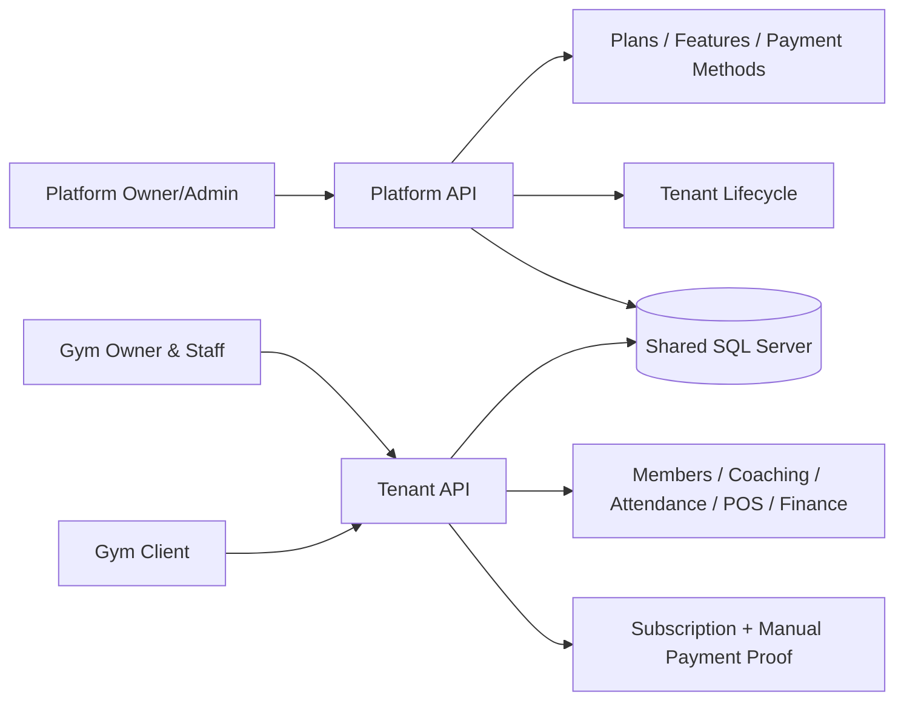
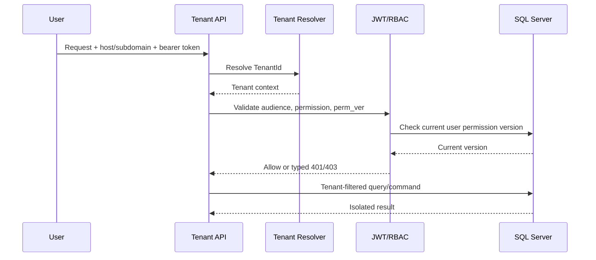
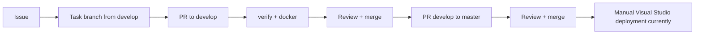

# LogicFit Project Status

Last reviewed: 2026-07-23

## Executive summary

LogicFit is a multi-tenant gym-management SaaS. The platform operator manages gyms, plans, features, payment methods, and manual payment approvals. Each gym receives an isolated tenant workspace for staff and clients. Billing is intentionally manual: no gateway, webhook, or automatic card charge is enabled.

## Product map

## Request and security flow

## User journeys

1. Platform admin onboards a gym, assigns an owner, and activates or suspends the tenant.
2. Gym owner selects a SaaS plan and receives `PendingPayment` status.
3. Owner pays through an out-of-band manual method and uploads proof.
4. Platform operator approves or rejects the request. Approval atomically activates/extends the subscription, records payment and invoice data, and notifies the owner.
5. Owner and staff use tenant features according to roles, permissions, plan features, and live usage limits.
6. Client registers only as a Client and can access self-service data after tenant resolution.

## Data model boundaries

- Identity: users, refresh tokens, roles, permissions, role assignments, permission version.
- Tenancy: tenants, branches, tenant status, suspension reason, tenant access state.
- Commercial: plans, plan features, subscriptions, payment methods, payment requests, payments, invoices.
- Gym operations: clients, coaches, appointments, classes, attendance, workouts, diets, measurements, products, stock, sales, expenses, employees.
- Cross-cutting: notifications, audit logs, uploads, concurrency row versions.
- Every tenant-owned aggregate carries a tenant boundary enforced by EF query filters and command ownership checks.

## API contracts

- Tenant audience: `LogicFitUsers`.
- Platform audience: `LogicFitPlatform`.
- Health endpoint: `GET /health` on both hosts; it includes database readiness.
- Authentication: login, registration, refresh rotation, logout/revocation, password reset/change.
- Errors use typed status/code/message/errors payloads; authorization and concurrency failures are not silently converted to success.
- Swagger/OpenAPI is enabled for development inspection; production health remains anonymous for monitoring.

## Operational rules

- Manual billing is the current and supported payment model.
- Migrations are reviewed and generated idempotently before production application; the API does not silently migrate production at startup.
- Wallet, stock, coupon, approval, and counter-like shared state must use transactions, row versions, unique constraints, or idempotency keys as appropriate.
- Secrets, publish profiles, passwords, refresh tokens, payment proofs, and reset tokens never enter Git or logs.

## Development and release flow

- `develop` is protected integration; `master` is protected release history.
- Direct pushes, force pushes, and branch deletion are prohibited.
- Every non-trivial task requires a GitHub Issue, task branch, tests, documentation impact, and PR.
- GitHub CI is active on every push and pull request. It restores, builds, tests, validates EF migrations, and builds both Docker images.
- Automatic Monster ASP CD is intentionally paused because deployment is currently performed manually from Visual Studio.

## Current deployment position

- Verified live endpoint: `https://logicfit-platform.runasp.net/health` returns `200 Healthy`.
- The supplied publish profile targets the Platform API site `site78301` only.
- GitHub Clone-to-`/wwwroot` is not used: it clones source files and cannot safely host the two independent ASP.NET Core API processes in one directory.
- The supported current operation is manual Visual Studio/WebDeploy publishing. Automatic CD can be revisited after the hosting topology, tenant target, backup, migration, rollback, and health URLs are explicitly defined.

## Current product

LogicFit is a .NET 8 multi-tenant gym-management SaaS backend. It contains two APIs that share the Application, Domain, Infrastructure, and database layers:

- `LogicFit.API`: tenant/gym operations, audience `LogicFitUsers`.
- `LogicFit.Platform.API`: SaaS administration and manual billing, audience `LogicFitPlatform`.

The current billing model is manual payment approval. No payment gateway or webhook integration is enabled.

## Current architecture

The solution uses Clean Architecture-style boundaries, MediatR CQRS, EF Core/SQL Server, JWT authentication, database-backed RBAC, FluentValidation, Serilog, Docker, and xUnit.

Tenant requests resolve a tenant before authorization. Tenant query filters, tenant access gates, permission policies, and MediatR behaviors are used together. Platform users operate without a tenant claim.

## Recent correctness and security changes

- Password reset tokens are cryptographically generated, hashed at rest, short-lived, and only exposed in Development when explicitly enabled.
- Password change and reset use the registration password policy.
- Tenant ownership checks restrict client access to their own appointments, subscriptions, workout/diet plans, measurements, class enrollments, and bookings.
- Manual and QR gate access validate active client accounts, active subscriptions, and subscription freezes.
- Permission authorization validates the JWT `perm_ver` against the current database `PermissionsVersion`.
- Duplicate subscription refunds are rejected.
- Audit logs redact password and token properties.
- Upload deletion is constrained to the uploads root; upload subfolders and MIME types are validated.
- Global API rate limiting is enabled with configurable defaults.
- Wallet and stock entities use SQL Server rowversion concurrency tokens.
- Coupon uses use a rowversion concurrency token.
- Manual wallet transactions validate balance and update the user wallet balance.
- POS validates positive quantities, non-negative discounts, and duplicate products.
- Sale and invoice numbers no longer use `Count + 1`; they use collision-resistant timestamp/UUID values.
- EF concurrency conflicts return HTTP 409.

## Database migrations added by the hardening work

- `AddWalletAndStockConcurrency`
- `AddCouponConcurrency`

Migrations must be applied explicitly during deployment after a tested backup. The API does not silently migrate production at startup.

## Verification status

- `dotnet test LogicFit.sln -c Release --no-restore`: 53 passing tests.
- `dotnet build LogicFit.sln -c Release --no-restore`: successful.
- Three existing nullable warnings remain in coach-client and client-subscription query projections.

## CI/CD policy

- Every pull request must restore, build, test, validate the migration script, and build both Docker images.
- Production deployment must be a protected GitHub Environment operation and must run a health check after deployment.
- Production deployment must have a rollback procedure and must not expose secrets in repository files or logs.
- A future task that changes API, database, security, deployment, or behavior must update this document and add a GitHub Issue describing scope, acceptance criteria, tests, and deployment impact.

## GitHub workflow

- Work starts from the latest `origin/develop`; `develop` is the protected integration branch.
- Task branches use `feature/<issue>-<slug>`, `fix/<issue>-<slug>`, or `chore/<issue>-<slug>`.
- Every task is merged through a reviewed Pull Request into `develop`; direct pushes and force-pushes are prohibited.
- Releases are reviewed Pull Requests from `develop` into protected `main`/`master`.
- Required CI checks are `verify` and `docker`; at least one approval is required.

## Known remaining work

- Replace in-process rate limiting and memory cache with gateway/Redis-backed distributed controls for multi-instance production.
- Use atomic SQL updates/transactions for wallet and stock hot paths, and add concurrency integration tests.
- Add coupon usage idempotency and payment request idempotency keys.
- Move private uploads to object storage with signed URLs and malware scanning.
- Add distributed locks/idempotency for background lifecycle jobs.
- Add integration, end-to-end, load, concurrency, and tenant-isolation tests.
- Define the Monster ASP deployment target, application directory, service manager, backup command, and health URL before enabling automatic production deployment.
- A local WebDeploy settings file was provided for `logicfit-platform.runasp.net` (`MSDeploy`, site `site78301`). It configures the Platform API only; its password is intentionally not recorded. A separate Tenant API publish profile and the production backup/migration/rollback procedure are still required.
- `Scripts/deploy-webdeploy.ps1` now performs credential-safe MSDeploy synchronization from a publish output directory. The protected CD workflow requires both Platform and Tenant profiles plus health URLs before it can deploy.

## Change log

### 2026-07-23

- Hardened tenant ownership and class enrollment flows.
- Hardened manual wallet transactions, POS validation, and concurrency handling.
- Added concurrency migrations for wallet/stock and coupons.
- Added file path/MIME validation and API rate limiting.
- Added initial CI/CD and project-status documentation.
- Established the protected `develop` integration-branch workflow and task-branch/PR rules.
