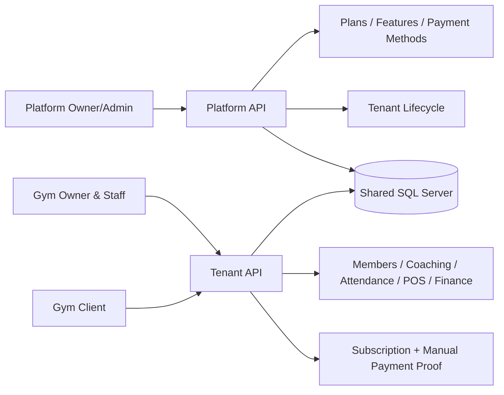
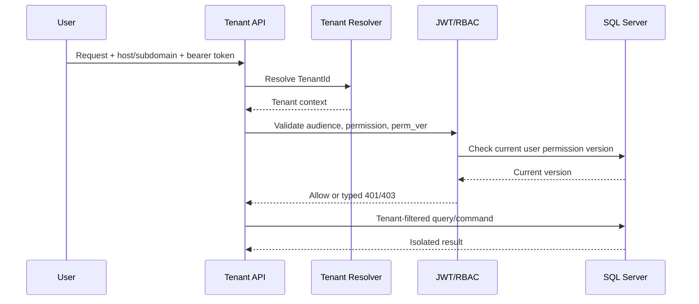
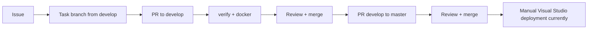

# LogicFit Project Status

Last reviewed: 2026-07-30

## Executive summary

LogicFit is a multi-tenant gym-management SaaS. The platform operator manages gyms, plans, features, payment methods, and manual payment approvals. Each gym receives an isolated tenant workspace for staff and clients. Billing is intentionally manual: no gateway, webhook, or automatic card charge is enabled.

> **Unreleased Issue #113 branch:** email-only identity verification and email password-reset security are implemented in the task branch. They require migration `20260730143000_AddIdentityEmailSecurity`, server-only email/link configuration, frontend integration, CI, review, and deployment before they become production behavior.
>
> The same branch adds one-use email-bound workspace invitations, owner-controlled client join codes, WebAuthn passkey sign-in/registration/step-up, and additive migrations `20260730150000_AddWorkspaceInvites`, `20260730151000_AddWorkspaceClientJoinCodes`, and `20260730153000_AddIdentityPasskeys`.

## Product map


```mermaid
flowchart LR
    Owner[Platform Owner/Admin] --> P[Platform API]
    P --> Catalog[Plans / Features / Payment Methods]
    P --> Lifecycle[Tenant Lifecycle]
    Gym[Gym Owner & Staff] --> T[Tenant API]
    Client[Gym Client] --> T
    T --> GymOps[Members / Coaching / Attendance / POS / Finance]
    T --> Billing[Subscription + Manual Payment Proof]
    P --> DB[(Shared SQL Server)]
    T --> DB
```

## Request and security flow


```mermaid
sequenceDiagram
    participant U as User
    participant API as Tenant API
    participant TM as Tenant Resolver
    participant Auth as JWT/RBAC
    participant DB as SQL Server
    U->>API: Request + host/subdomain + bearer token
    API->>TM: Resolve TenantId
    TM-->>API: Tenant context
    API->>Auth: Validate audience, permission, perm_ver
    Auth->>DB: Check current user permission version
    DB-->>Auth: Current version
    Auth-->>API: Allow or typed 401/403
    API->>DB: Tenant-filtered query/command
    DB-->>API: Isolated result
```

## User journeys

1. Platform admin onboards a gym, assigns an owner, and activates or suspends the tenant.
2. Gym owner selects a SaaS plan and receives `PendingPayment` status.
3. Owner pays through an out-of-band manual method and uploads proof.
4. Platform operator approves or rejects the request. Approval atomically activates/extends the subscription, records payment and invoice data, and notifies the owner.
5. Owner and staff use tenant features according to roles, permissions, plan features, and live usage limits.
6. Client registers only as a Client and can access self-service data after tenant resolution.

## Data model boundaries

- Identity: users, refresh tokens, roles, permissions, role assignments, permission version.
- Tenancy: tenants, branches, tenant status, suspension reason, tenant access state.
- Commercial: plans, plan features, subscriptions, payment methods, payment requests, payments, invoices.
- Gym operations: clients, coaches, appointments, classes, attendance, workouts, diets, measurements, products, stock, sales, expenses, employees.
- Cross-cutting: notifications, audit logs, uploads, concurrency row versions.
- Every tenant-owned aggregate carries a tenant boundary enforced by EF query filters and command ownership checks.

## Freelance workspace foundation (production migrations verified)

- `WorkspaceType.FreelanceCoach` keeps an independent coach in the existing tenant isolation boundary; legacy tenants default to `Gym`.
- A global `IdentityAccount` is linked to tenant-local `DomainUsers` and `WorkspaceMemberships`. Existing `/api/auth/login` remains supported and creates this link lazily after a successful legacy login; it never fails an existing login because of an identity collision.
- New `/api/identity/login` performs identity-first sign-in and returns active workspaces and pending applications together. `/api/identity/select-workspace` exchanges its short-lived opaque selection token for the existing tenant JWT/refresh-token contract.
- Public freelance onboarding uses `ApplicationRequests`, immutable submission revisions, and short-lived opaque tracking sessions. Applicants may edit only the field names requested by Platform Admin, then resubmit; rejected requests remain terminal evidence.
- Platform Admin reviews a minimal, non-health/non-training application view through `/api/platform/workspace-applications`. Review, information-request, approval, and rejection use row-version concurrency; rejection revokes tracking sessions and review decisions enqueue an Outbox event.
- Approval reserves one `Provisioning` workspace before creating the Freelance Owner, its active workspace membership, role assignment, branding profile, and final `Active` workspace. A retry reuses the reserved workspace; a provisioning database failure records `ProvisioningFailed` for operator retry.
- A Freelance Owner can sponsor an existing global identity as `FreelanceCoach`, `FreelanceAssistant`, or `Client`; that creates a separate membership application and never grants access directly. Platform approval repeats the live plan-capacity check and only then creates the tenant-local user, role assignment, and active membership. Capacity errors use `PLAN_MEMBER_LIMIT_REACHED` or `PLAN_CLIENT_LIMIT_REACHED`.
- Freelance workspace branding reuses tenant branding for colors, logos, cover/background, and report identity, and adds a structured profile for bio, specialties, certifications, social links, welcome content, and booking settings.
- Subscription policy is now explicit in the access gate: `Trial`, `Active`, and `PastDue` operate normally; `Expired` is read-only while billing/renewal remains available; suspended/archived/provisioning workspaces hard-block operational access. Legacy gyms without a SaaS subscription record preserve their existing operational access during the migration rollout; a new freelance workspace without a subscription is billing-only.
- Migrations `20260729100428_AddFreelanceWorkspaceFoundation`, `20260729103016_CompleteFreelanceWorkspaceFoundation`, and `20260729103719_AddTenantApprovalConcurrency` are additive and reviewed locally. The third migration adds the tenant row-version used to serialize final membership-capacity approval. `20260729133325_SeedFreelanceSystemRoles` is an idempotent corrective data migration that creates or restores the three freelance system roles and their permission maps; it must be applied explicitly before a Platform Admin approves a freelance workspace. Production schema application remains a protected CI/CD operation with health-check and rollback review.
- Team membership now uses `/api/freelance/team/invites` and `/api/workspace-invites/{preview,accept}`. The invitation is tied to normalized email, workspace, and role; acceptance requires a verified identity session and a live quota check.
- Client acquisition supports owner-generated `/api/workspace/client-join-codes` plus preview/join endpoints. Raw codes are returned only once, stored as hashes, expire/revoke, and either activate the client or create a pending owner approval according to workspace settings.
- Passkey ceremonies are five-minute and one-use; credentials are unique, and sensitive Platform mutations require a recent passkey step-up.

## API contracts

- Tenant audience: `LogicFitUsers`.
- Platform audience: `LogicFitPlatform`.
- Health endpoint: `GET /health` on both hosts; it includes database readiness.
- Authentication: login, registration, refresh rotation, logout/revocation, password reset/change.
- Errors use typed status/code/message/errors payloads; authorization and concurrency failures are not silently converted to success.
- Swagger/OpenAPI is enabled for development inspection; production health remains anonymous for monitoring.
- The complete source-derived endpoint contract is in [API-ENDPOINT-CATALOG.md](API-ENDPOINT-CATALOG.md). It currently indexes both API hosts and is regenerated through `Scripts/Export-ApiEndpointCatalog.ps1` whenever a controller contract changes.

## Operational rules

- Manual billing is the current and supported payment model.
- Migrations are reviewed and generated idempotently before production application. `DataSeeder.InitializeAsync` can apply pending migrations asynchronously only when `Database:ApplyMigrationsOnStartup=true`; it logs each pending migration, emits a critical log and rethrows on failure so startup stops on an incomplete schema, and remains `false` by default. Seed work is separately controlled by `Database:ApplySeedOnStartup`; it is enabled for local development compatibility and disabled in Production to avoid unrequested data changes.
- Wallet, stock, coupon, approval, and counter-like shared state must use transactions, row versions, unique constraints, or idempotency keys as appropriate.
- Secrets, publish profiles, passwords, refresh tokens, payment proofs, and reset tokens never enter Git or logs.

## Development and release flow


```mermaid
flowchart LR
    D[Issue] --> B[Task branch from develop]
    B --> PR1[PR to develop]
    PR1 --> CI[verify + docker]
    CI --> R1[Review + merge]
    R1 --> REL[PR develop to master]
    REL --> R2[Review + merge]
    R2 --> Deploy[Manual Visual Studio deployment currently]
```

- `develop` is protected integration; `master` is protected release history.
- Direct pushes, force pushes, and branch deletion are prohibited.
- Every non-trivial task requires a GitHub Issue, task branch, tests, documentation impact, and PR.
- GitHub CI is active on every push and pull request. It restores, builds, tests, validates EF migrations, and builds the unified API Docker image.
- Automatic Monster ASP CD is intentionally paused because deployment is currently performed manually from Visual Studio.

## Current deployment position

- Verified live endpoint: `https://logicfit-platform.runasp.net/health` returns `200 Healthy`.
- The supplied publish profile targets the intended unified API site `site78301`; its password is intentionally not recorded.
- GitHub Clone-to-`/wwwroot` is not used: it clones source files and cannot safely host the compiled ASP.NET Core application.
- The supported current operation is manual Visual Studio/WebDeploy publishing. Automatic CD can be revisited after the unified host, backup, migration, rollback, and health URL are explicitly defined.

### Platform administration API remediation (2026-07-25)

- `GET /api/platform/dashboard` returns `401` only when the dashboard has no valid platform JWT; the endpoint returns `200` with a valid Platform Owner token.
- `GET /api/platform/plans` now materializes plan features before constructing `FeatureLimits`. A SQL-translated projection cannot construct a CLR `Dictionary`, which previously caused a server-side `500`.
- `GET /api/platform/operations/jobs`, `/operations/outbox`, and `/alerts` require the `JobExecutionLogs` and `OutboxMessages` tables introduced by migration `20260725115322_AddOutboxAndJobExecution`. A `500` on all three endpoints indicates that the migration was applied to a different database/site or the running Platform host uses a different connection string; apply and verify the migration against the database configured for `https://logicfit-saas.runasp.net`.
- The platform backup flow uses portable, unencrypted `.bacpac` exports containing the live SQL schema and data. This avoids the unsupported assumption that a shared SQL Server can write a `.bak` file to the web-host disk.
- `GET /api/platform/backups/status` is permission-protected and returns only safe readiness data: enabled/ready state, `BACPAC` format, retention, UTC schedule, count, and an Arabic configuration reason when unavailable. It never returns paths, connection strings, or secrets.
- `GET /api/platform/backups` lists completed private exports. `POST /api/platform/backups` serializes export work, creates one BACPAC, removes incomplete temporary files, and keeps the last seven days. A second concurrent request receives `503` rather than creating a conflicting export.
- `GET /api/platform/backups/{fileName}/download` streams an attachment only after the same platform-backup permission check. The filename must match the BACPAC naming contract and cannot contain a path; missing/invalid names return `404`. The backup directory remains under `App_Data` and is never a public static-files path.
- After publishing the Issue #34 code, add the following non-secret section to the server-only `appsettings.Production.json`, retain the existing JWT/password-reset secrets, then recycle the application: `Backup:Enabled=true`, `Backup:StorageDirectory=App_Data/PrivateBackups`, `Backup:RetentionDays=7`, and `Backup:RunAtUtc=02:00:00`. Do not use the retired `Backup:Directory` setting and never place the export folder under `wwwroot`.
- A BACPAC restore remains an explicit operator procedure using DacFx/SqlPackage against a reviewed target database; the application never performs automatic restore or database replacement.

## Repository decomposition

```text
LogicFit.sln
├── LogicFit.Domain/          Entities, enums, authorization catalog, domain rules
├── LogicFit.Application/     CQRS features, handlers, validators, behaviors, interfaces
├── LogicFit.Infrastructure/  EF Core, SQL mappings, migrations, JWT, RBAC, jobs, persistence
├── LogicFit.API/              Unified ASP.NET Core host
│   ├── Features/              Tenant auth, tenants, clients, coaching, nutrition, commerce, HR, reports
│   ├── Features/Platform/     Platform auth, dashboard, tenants, plans, features, subscriptions,
│   │                          payment methods and manual payment requests
│   ├── Middleware/            Tenant resolution/access, exception handling, request context
│   ├── Authorization/         Tenant policies and permission integration
│   └── Extensions/            Dependency injection and host setup
├── LogicFit.Tests/            Unit and feature regression tests
├── Scripts/                   Deployment and verification scripts
├── docs/                      Status, decisions, API/deployment documentation
└── .github/workflows/         CI and guarded CD workflows
```

## Tenant API feature inventory

The Tenant API feature folders are: `Appointments`, `Attendance`, `Auth`, `BodyMeasurements`, `Branches`, `Branding`, `Challenges`, `Chat`, `ClassSchedules`, `ClientDashboard`, `Clients`, `CoachClients`, `Coaches`, `Commissions`, `Coupons`, `DietPlans`, `Employees`, `Equipment`, `Exercises`, `ExpenseCategories`, `Expenses`, `Foods`, `GateAccess`, `GroupClasses`, `GymProfile`, `Invoices`, `Leaves`, `Maintenance`, `MealLogs`, `Meals`, `MembershipCards`, `Muscles`, `Notifications`, `NutrientDefinitions`, `Payments`, `Payroll`, `ProductCategories`, `Products`, `Profile`, `Recipes`, `Reports`, `Rooms`, `Sales`, `Shifts`, `Stock`, `Subscriptions`, `Suppliers`, `TaxSettings`, `TenantBilling`, `Tenants`, `Transactions`, `Users`, `WorkoutPrograms`, and `WorkoutSessions`.

### Tenant API route families

All routes are under `/api` unless noted:

| Family | Main responsibilities |
|---|---|
| `auth` | Register client, login, refresh rotation, logout-all, forgot/reset/change password |
| `branding` | Public branding lookup by subdomain/custom identifier |
| `client` | Client dashboard, programs, diet plans, subscriptions, measurements, coach, appointments |
| `clients`, `coaches`, `coach-clients`, `users` | Tenant people, staff, assignments, ownership checks |
| `appointments`, `class-schedules`, `group-classes` | Booking, recurrence materialization, cancellation, attendance |
| `attendance`, `gate-access`, `membership-cards` | Check-in/out, QR access, access logs, card issuance/revocation |
| `workout-programs`, `workout-sessions`, `exercises`, `muscles` | Training catalog and client progress |
| `diet-plans`, `meals`, `meal-logs`, `foods`, `recipes`, `nutrient-definitions` | Nutrition plans, meals, food/micronutrient data, logging |
| `body-measurements`, `profile`, `gym-profile` | Health measurements, account profile, gym branding/media |
| `subscriptions`, `tenant-billing`, `payments`, `invoices`, `transactions` | Subscription status, manual payment flow, invoices and wallet/finance transactions |
| `products`, `product-categories`, `stock`, `sales`, `coupons` | POS, inventory, checkout, discounts and concurrency-safe stock |
| `expenses`, `expense-categories`, `reports`, `tax-settings` | Finance, tax configuration and operational/financial reporting |
| `employees`, `shifts`, `leaves`, `payroll`, `commissions` | HR, scheduling, leave review, payroll and commissions |
| `branches`, `rooms`, `equipment`, `maintenance` | Multi-branch facilities, rooms, equipment lifecycle and maintenance |
| `notifications`, `chat`, `challenges` | In-app notifications, participant-only conversations, challenge progress/leaderboards |

## Platform API inventory

The Platform API exposes these route families under `/api/platform` and requires the `LogicFitPlatform` JWT audience plus platform permissions:

| Route family | Responsibilities |
|---|---|
| `/auth` | Platform login, refresh rotation, logout-all |
| `/dashboard` | Platform-wide operational summary |
| `/tenants` | List/create tenants; approve, suspend, activate, archive lifecycle actions |
| `/plans` | SaaS plan CRUD, prices, billing cycles and limits |
| `/features` | SaaS feature catalog and plan feature assignment |
| `/subscriptions` | Platform-wide subscription visibility and administration |
| `/payment-methods` | Manual payment channel CRUD |
| `/payment-requests` | List requests; approve/reject with reason and atomic billing effects |
| `/administrators`, `/roles` | Platform operator accounts and role-permission administration; owner-only sensitive mutations |
| `/audit-logs`, `/invoices` | Read-only, paginated audit and financial records |
| `/alerts`, `/operations` | Paginated operational alerts, job execution logs and Outbox monitoring |
| `/backups` | Private BACPAC backup status, creation, paginated history and authorized streaming download |

### Platform collection pagination contract

All Platform administration collection routes now accept one-based `page` and `pageSize` query parameters. `pageSize` is clamped from `1` to `100` (default `20`). Responses have the consistent camel-case shape:

```json
{
  "items": [],
  "totalCount": 0,
  "page": 1,
  "pageSize": 20,
  "totalPages": 0,
  "hasPreviousPage": false,
  "hasNextPage": false
}
```

The contract applies to tenants, subscriptions, payment requests, plans, payment methods, features, feature overrides/dependencies/quota definitions, administrators, roles, alerts, audit logs, invoices, operations, and backup history. Tenant, subscription, payment request, administrator, role, audit, invoice, job, and Outbox queries page at the database level. Small configuration catalogs use the same response shape while preserving their existing application query contracts.

### Administration mutation boundaries

- Plans and payment methods support create, update, and guarded deletion.
- Features are created and updated/archived; feature dependencies are created and removed; quotas and tenant overrides are upserted/deactivated rather than destructively deleted.
- Tenants, subscriptions, administrators, and payment requests use lifecycle actions (approve, suspend, activate, archive, extend, approve/reject) instead of unsafe generic deletion.
- Invoices, audit logs, jobs, Outbox records, alerts, reports, and backup records are operational/financial history and intentionally have no edit/delete API.

## Migration history groups

- Foundation and identity: initial schema, phone/password reset, profile and nutrition fields.
- Gym operations: coach/client, branches, access control, equipment/rooms, classes, finance, POS, HR/payroll.
- SaaS: RBAC/refresh tokens, plans/subscriptions, manual billing, usage, audit/reminders, custom domains.
- Security/correctness: tenant suspension reason, wallet/stock rowversion, coupon rowversion.

The authoritative migration files live in `LogicFit.Infrastructure/Persistence/Migrations`. Use an idempotent script for deployment and never edit an applied migration in place.

## API documentation maintenance rule

When adding or changing a controller, route, request/response DTO, permission, database entity, migration, background job, or deployment contract, update this document and the relevant frontend/API guide in the same task PR. The controller attributes remain the source of truth for exact routes; generated Swagger is the source of truth for schemas.

## Current product

LogicFit is a .NET 8 multi-tenant gym-management SaaS backend with one ASP.NET Core host: `LogicFit.API`.

- `LogicFit.API/Features`: tenant/gym operations, audience `LogicFitUsers`.
- `LogicFit.API/Features/Platform`: SaaS administration and manual billing, audience `LogicFitPlatform`.

The current billing model is manual payment approval. No payment gateway or webhook integration is enabled.

## Current architecture

The solution uses Clean Architecture-style boundaries, MediatR CQRS, EF Core/SQL Server, JWT authentication, database-backed RBAC, FluentValidation, Serilog, Docker, and xUnit.

Tenant requests resolve a tenant before authorization. Tenant query filters, tenant access gates, permission policies, and MediatR behaviors are used together. Platform users operate without a tenant claim.

## Recent correctness and security changes

- Password reset tokens are cryptographically generated, hashed at rest, short-lived, and only exposed in Development when explicitly enabled.
- Password change and reset use the registration password policy.
- Tenant ownership checks restrict client access to their own appointments, subscriptions, workout/diet plans, measurements, class enrollments, and bookings.
- Manual and QR gate access validate active client accounts, active subscriptions, and subscription freezes.
- Permission authorization validates the JWT `perm_ver` against the current database `PermissionsVersion`.
- Duplicate subscription refunds are rejected.
- Audit logs redact password and token properties.
- Upload deletion is constrained to the uploads root; upload subfolders and MIME types are validated.
- Global API rate limiting is enabled with configurable defaults.
- Wallet and stock entities use SQL Server rowversion concurrency tokens.
- Coupon uses use a rowversion concurrency token.
- Manual wallet transactions validate balance and update the user wallet balance.
- POS validates positive quantities, non-negative discounts, and duplicate products.
- Sale and invoice numbers no longer use `Count + 1`; they use collision-resistant timestamp/UUID values.
- EF concurrency conflicts return HTTP 409.

## Database migrations added by the hardening work

- `AddWalletAndStockConcurrency`
- `AddCouponConcurrency`

Migrations must be applied explicitly during deployment after a tested backup. The API ignores `Database__ApplyMigrationsOnStartup` and does not silently migrate production at startup; a deployment can optionally verify its health endpoint after publishing.

## Verification status

- `dotnet test LogicFit.sln -c Release --no-build --verbosity minimal`: 80 passing tests.
- `dotnet build LogicFit.sln -c Release --no-restore`: successful; four pre-existing nullable warnings remain in coach-client, gate-access, and client-subscription query projections.
- `npm run build` in `LogiFit_Platform_Admin_Dashboard`: successful.

## CI/CD policy

- Every pull request must restore, build, test, validate the migration script, and build the unified API Docker image.
- Production deployment must be a protected GitHub Environment operation and must run a health check after deployment.
- Production deployment must have a rollback procedure and must not expose secrets in repository files or logs.
- A future task that changes API, database, security, deployment, or behavior must update this document and add a GitHub Issue describing scope, acceptance criteria, tests, and deployment impact.

## GitHub workflow

- Work starts from the latest `origin/develop`; `develop` is the protected integration branch.
- Task branches use `feature/<issue>-<slug>`, `fix/<issue>-<slug>`, or `chore/<issue>-<slug>`.
- Every task is merged through a reviewed Pull Request into `develop`; direct pushes and force-pushes are prohibited.
- Releases are reviewed Pull Requests from `develop` into protected `main`/`master`.
- Required CI checks are `verify` and `docker`; at least one approval is required.

## Known remaining work

- Replace in-process rate limiting and memory cache with gateway/Redis-backed distributed controls for multi-instance production.
- Use atomic SQL updates/transactions for wallet and stock hot paths, and add concurrency integration tests.
- Add coupon usage idempotency and payment request idempotency keys.
- Move private uploads to object storage with signed URLs and malware scanning.
- Add distributed locks/idempotency for background lifecycle jobs.
- Add integration, end-to-end, load, concurrency, and tenant-isolation tests.
- Define the Monster ASP deployment target, application directory, service manager, backup command, and health URL before enabling automatic production deployment.
- A local WebDeploy settings file was provided for `logicfit-platform.runasp.net` (`MSDeploy`, site `site78301`). It is the candidate profile for the unified API; its password is intentionally not recorded. Verify the target, backup/migration/rollback procedure, and health URL before enabling production CD.
- `Scripts/deploy-webdeploy.ps1` performs credential-safe MSDeploy synchronization from one unified publish output directory. The protected CD workflow requires one unified profile and health URL before it can deploy.

## Change log

### 2026-07-30 — identity-first access foundation

- Added one identity/membership/local-user gate to legacy login, refresh rotation, workspace selection, and every authenticated tenant request. Linked accounts now lose access immediately when their identity, membership, or tenant-local user becomes inactive; unlinked legacy accounts remain behind an explicit temporary compatibility setting.
- Normalized subscription access for cancellation: a cancelled subscription remains operational strictly before `EndDate`, then resolves to `Expired` and read-only without waiting for a background lifecycle update.
- Deferred verified-email legacy linking, invitations, QR/join code, and workspace-owned client approval to issue #113 so no incomplete public-registration or approval flow is introduced.

### 2026-07-30

- Moved the Platform workspace-application review controller into the unified `LogicFit.API` host. The existing `/api/platform/workspace-applications/*` review contract is now compiled, covered by the unified-module regression test, and included in the generated endpoint catalog.
- Added `docs/FEATURE-CATALOG.md` as the central, source-linked registry for every current Platform, workspace, finance, fitness, HR, inventory, and communication feature family across the three LogicFit projects.
- Added `docs/AUTHENTICATION-AND-WORKSPACE-FLOWS.md` as the canonical record of the legacy and identity-first login contracts, application tracking/recovery, freelance workspace approval, team membership, and workspace access gates.
- Added a mandatory documentation-currency gate to `AGENTS.md`: every implementation change must update its affected feature catalog and user flow in the same Pull Request, and API contract changes must regenerate the endpoint catalog.

### 2026-07-27

- Consolidated Platform controllers into `LogicFit.API/Features/Platform` and removed the standalone Platform API project.
- Unified local Docker, CI, guarded CD, and configuration around one API host, one appsettings file, and one deployment artifact.
- Removed the committed database connection string; local and production secrets must be supplied through User Secrets or the environment/secret store.
- WebDeploy preserves server-only `appsettings.Production.json`, so Monster ASP production secrets are not committed or replaced during an application sync.

### 2026-07-25

- Added one shared Platform API pagination contract and bounded `page`/`pageSize` behavior.
- Moved high-volume platform tenants, subscriptions, and payment-request list queries to database-level paging.
- Paginated platform audit, invoice, administrators, roles, alerts, operations, and backup collection endpoints.
- Added authorized configuration-edge removal for feature dependencies; no historical subscription or financial data is modified.
- Added a reusable Arabic server paginator to the Angular administration dashboard and connected every collection screen to it.
- Standardized the dashboard list-page shell, empty/loading/error states, action toolbars, and CRUD/lifecycle boundaries.
- Rebuilt feature overrides, feature dependencies, and quota management screens with controlled create/update/delete-or-lifecycle actions.
- Added a complete Arabic documentation index covering product flows, users/permissions, the Platform dashboard, API inventory, SaaS domain/data, tenant application, operations, and deployment.
- Added an in-dashboard operational assistant with contextual help for every protected Platform route, permission-filtered Arabic command search, and safe quick actions that only navigate, refresh, or open existing confirmed forms.
- Added the dashboard Tailwind/PrimeNG style guide and verified the dashboard build after the assistant integration.
- Added the authenticated `/documentation` screen to the Platform dashboard, with Arabic search across product, API, security, data, operations, design, and a direct catalog of every dashboard screen.
- Split dashboard-owned documentation into its own architecture/integration guide and screen catalog, and refreshed both repository READMEs with Mermaid diagrams and maintenance links.

### 2026-07-23

- Hardened tenant ownership and class enrollment flows.
- Hardened manual wallet transactions, POS validation, and concurrency handling.
- Added concurrency migrations for wallet/stock and coupons.
- Added file path/MIME validation and API rate limiting.
- Added initial CI/CD and project-status documentation.
- Established the protected `develop` integration-branch workflow and task-branch/PR rules.
